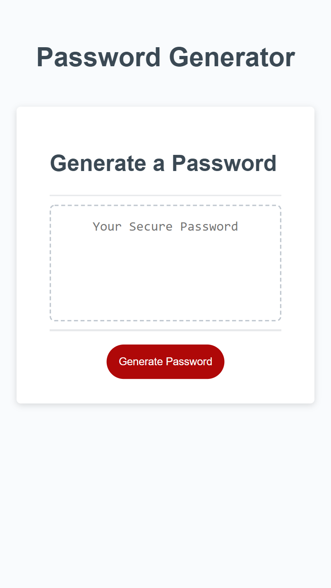
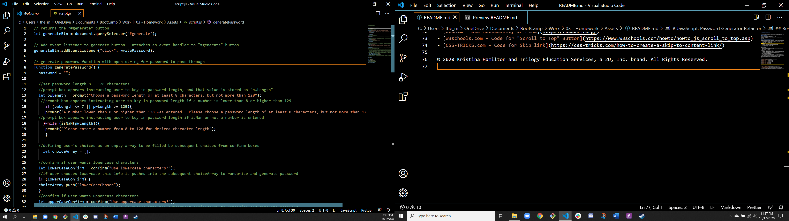

# JavaScript: Password Generator Refactor

## Overview

 Code from an existing password generating application was provided by the client, and it was communicated that they desired to update it to be adaptive to multiple screen sizes for their employees' growing need to secure sensitive data while mobile.

## Client's Needs/Expectations

The client established that the following needs/expecations must be met:

- JavaScript is to be coded to power the dynamically updated HTML and CSS, so the password generating application may run in the browser.
- The user interface must be clean and polished so that is responsive, ensuring that it adapts to mulptiple screen sizes.
- Special characters may be selected by the user.

## Updates and Exepctations Obtained from Employee User Input

Through information and feedback provided by the employee users, the following update criteria were established:

- When the employee user needs a new, secure password, they can click the "generate password" button to:
  - Be presented with as series of on-screen prompts for password criteria
    - length of password - ranging in character size from 8 to 128
    - choice of character type to include in password
      - lowercase
       - uppercase
        - numeric
         - and/or special characters
- The employee input is to be validated and at least one character type selected.
- When all prompts are answered, then a password is generated that matches the selected critiera.
- When the password is generated it is written to the page.

## Overal Findings - Updates Made

- document.querySelector and add.EventListener deployed to "#generate" button to initiate employee user's password criteria prompt.
- When the employer use clicks the "#generate" button, the pwLength prompt appears.   
  - The user is instructed to choose a password length no lower than 8 characters, but no higher than 128.
  - The password length is stored from the prompt as pwLength.
  - If the user doesn't input a number within the given range, an if statement, if (pwLength <= 7 || pwLength >= 129), is in place to fire a prompt box.
 - If the user doesn't input a number, a while statement, }while (isNaN(pwLength)){, is in place to fire a prompt box.
- Confirmation boxes are deployed to confirm user's choices of:
  - lowercase characters, uppercase characters, numeric characters, and/or special characters.  
  - If no parameters are defined, if (choiceArray.length === 0), an alert box is fired advising user parameters must be selected and to press the "#generate" button to restart the process.
- User's selection of lowercase, uppercase, numeric and/or special characters are stored as:
  - lowerCaseConfirm, upperCaseConfirm, InclNumeric, and/or InclSpecial characters which are then pushed into the open choiceArray.
- Password choices for arrays are defined through:
  let upperCaseArray, lowerCaseArray, inclNumericArray and inclSpecialArray
- The choices from the choiceArray are then pulled through a for loop for the length of the respected arrays and randomized by (Math.random) to create the returned values and ensure one of each special criteria character is chosen.
- function writePassword () runs let password = generatePassword(); which enacts on the document.querySelector("#password"); and document.getElementById("password").innerHTML = password;
passwordText.innerText = password; writes the generated randomized password to the text box
- Media query elements are in place in the CSS to optimize the viewing page for varying screen sizes and mobile needs.

## Deployed Optimized Website and Final JavaScript Code

\*[Deployed website](https://kay0s.github.io/JavaScript-Password-Generator/)
\*[GitHub Repository](https://github.com/Kay0s/JavaScript-Password-Generator)

## Research Resources
- [w3.org - JavaScript Array push() Method](https://www.w3schools.com/jsref/jsref_push.asp)
- [OWASP - Password Special Characters](https://owasp.org/www-community/password-special-characters)
- [MDN web docs - Escaping Special Characters](https://developer.mozilla.org/en-US/docs/Web/JavaScript/Guide/Regular_Expressions/)

© 2020 Kristina Hamilton and Trilogy Education Services, a 2U, Inc. brand. All Rights Reserved.
